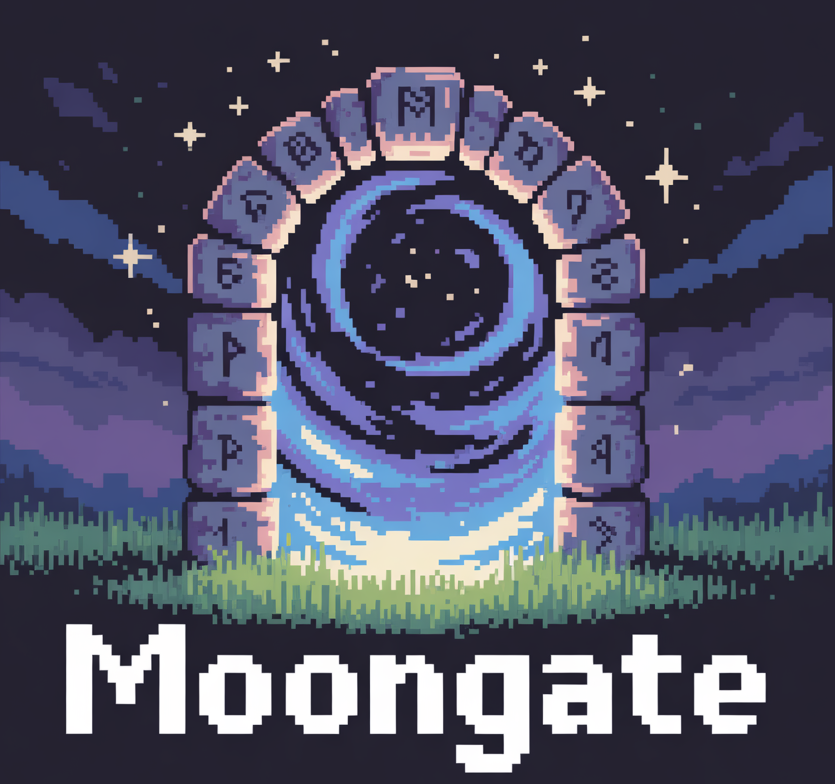
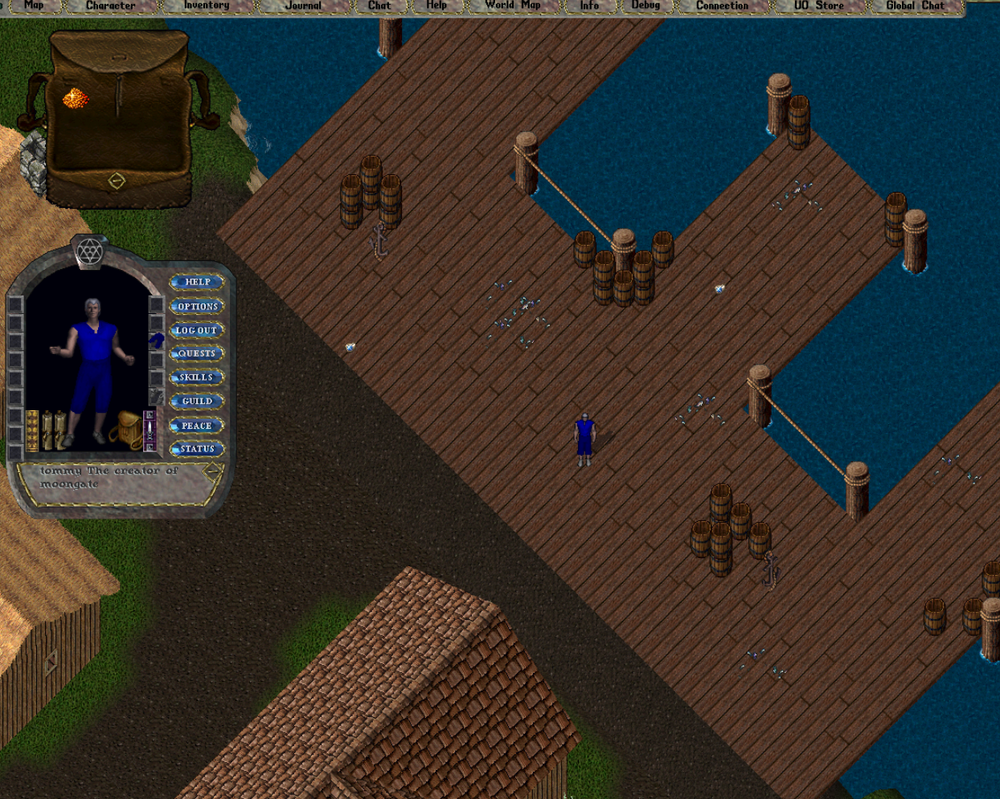
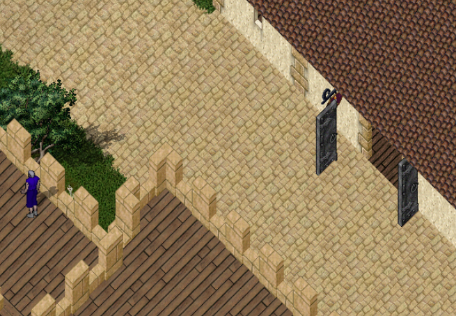
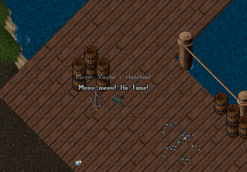
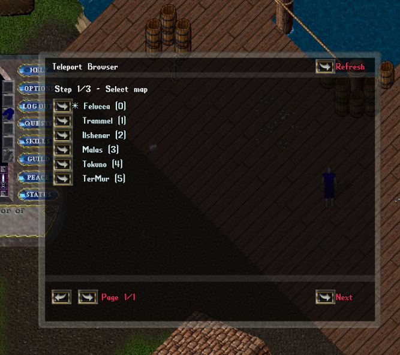

# Moongate Next

<p align="center">
  
</p>

<p align="center">
  <a href="https://github.com/moongate-community/moongate-next/actions/workflows/ci.yml">
    
  </a>
  <a href="https://github.com/moongate-community/moongate-next/actions/workflows/docs.yml">
    
  </a>
  <a href="https://github.com/moongate-community/moongate-next/actions/workflows/release.yml">
    
  </a>
  <a href="https://hub.docker.com/r/tgiachi/moongate-next">
    
  </a>
  <a href="LICENSE">
    
  </a>
</p>

Moongate Next is a modern Ultima Online server runtime built with .NET 10,
YAML-backed shard data, a Vite/React admin UI, Lua scripting, explicit plugin
extension points, persistence, metrics, and published GitHub Pages
documentation.

It is an experiment-driven rewrite focused on understanding the server from the
inside out: networking, data loading, runtime services, content authoring,
administration, packaging, and release automation.

## Why Another Rewrite?

Yes, rewriting a UO server from scratch is not the most practical path. I know.
Moongate Next exists because starting from a blank slate is how I like to learn:
it gives me room to test architecture ideas, rebuild systems from first
principles, and understand the tradeoffs by writing the code myself. Starting
over gives me clarity, curiosity, and the calm needed to keep exploring how
things work.

## Quick Start

### Requirements

- .NET SDK 10.0+
- Node.js 22+ for the admin UI
- Docker, if you want to build or run the container image
- Ultima Online client data files, including `tiledata.mul`

By default, Moongate looks for UO client files in `~/uo`. You can change that
after first boot in `<root>/config/moongate.yaml`:

```yaml
uo:
  client_files_directory: ~/uo
```

### Run The Server Locally

```bash
git clone https://github.com/moongate-community/moongate-next.git
cd moongate-next
dotnet restore Moongate.slnx
MOONGATE_ROOT="$HOME/moongate-next-data" dotnet run --project src/Moongate.Server -- --debug
```

On first boot, Moongate creates the runtime directory structure and writes a
default `moongate.yaml` when it is missing.

Useful default endpoints:

- Admin UI and HTTP API: `http://localhost:5265`
- Scalar API docs: `http://localhost:5265/api/docs`
- Metrics: `http://localhost:5265/metrics`
- UO TCP server: `localhost:2593`
- UO UDP ping server: `localhost:12000`

The development seed creates an administrator account:

```text
admin / admin
```

Change the password before using a reachable server.

### Run The Admin UI In Vite

The server can serve the built UI, but during frontend development use Vite:

```bash
cd ui
npm ci
npm run dev
```

The Vite dev server proxies API requests to `http://127.0.0.1:5265` by default.
Override that target with `VITE_API_TARGET` when the backend runs elsewhere.

### Build Everything

```bash
dotnet build Moongate.slnx
npm --prefix ui ci
npm --prefix ui run build
```

### Run Tests

```bash
dotnet test Moongate.slnx
```

## Docker

Build the image locally:

```bash
docker build -f src/Moongate.Server/Dockerfile -t moongate-next:local .
```

Run it with persistent server data and read-only UO client files:

```bash
docker run --rm -it \
  -p 8080:8080 \
  -p 2593:2593/tcp \
  -p 12000:12000/udp \
  -v "$HOME/moongate-next-data:/data" \
  -v "$HOME/uo:/home/app/uo:ro" \
  -e MOONGATE_ROOT=/data \
  moongate-next:local
```

The published image is:

```text
tgiachi/moongate-next
```

Tagged release images are pushed as:

```text
tgiachi/moongate-next:<tag>
```

## What Is In Scope Today

- UO TCP networking and packet dispatch.
- UDP ping support for UO launchers.
- YAML runtime configuration through `moongate.yaml`.
- Embedded YAML data assets copied into the runtime data directory.
- Item templates with art ids, hue, rarity, value, tags, params, and comments.
- Starter loadouts for base, race, and profession equipment.
- Loot tables with item, category, weighted pick, group, chance, and amount nodes.
- Persistence snapshot and journal services.
- Built-in command registry for server, in-game, plugin, and Lua commands.
- Lua scripting modules for server-side extensions.
- Trusted plugin loading and startup hooks.
- Admin authentication, metrics, live console, item template browsing, and API docs.
- GitHub Pages documentation and generated .NET API reference.
- CI, Docker build checks, semantic-release, NuGet packaging, release artifacts, and GitHub Pages docs deployment.

## Project Highlights

- Service startup is explicit and ordered through DryIoc registrations.
- Runtime data is YAML-first so shard data can be edited without recompiling.
- Item creation goes through templates, which keeps UI inspection, loadouts,
  loot, and runtime factories aligned.
- Loot tables validate against concrete item templates before the server starts.
- The Docker image publishes the server as a compressed .NET single-file app and
  embeds the built admin UI under `wwwroot`.
- Release automation builds Linux x64 and Windows x64 artifacts, Docker images,
  NuGet packages, changelog entries, and GitHub releases from conventional commits.

## Screenshots

### Web Admin UI

Moongate Next is moving toward a quiet, workspace-style admin UI for operational
tasks such as metrics, live console access, and item template inspection.


### In-Game Reference Screens

These images come from the Moongate experiment line and are kept as visual
reference while Moongate Next grows its own gameplay surface.









## Documentation

Published documentation:

<https://moongate-community.github.io/moongate-next/>

Useful starting points:

- Runtime configuration: <https://moongate-community.github.io/moongate-next/articles/runtime-configuration.html>
- Runtime API: <https://moongate-community.github.io/moongate-next/articles/runtime-api.html>
- Bundled data assets: <https://moongate-community.github.io/moongate-next/articles/data-assets.html>
- Item templates: <https://moongate-community.github.io/moongate-next/articles/item-templates.html>
- Starter loadouts: <https://moongate-community.github.io/moongate-next/articles/starter-loadouts.html>
- Loot system: <https://moongate-community.github.io/moongate-next/articles/loot-system.html>
- Commands: <https://moongate-community.github.io/moongate-next/articles/commands.html>
- Lua scripting: <https://moongate-community.github.io/moongate-next/articles/lua-scripting.html>
- Plugins: <https://moongate-community.github.io/moongate-next/articles/plugins.html>

## Release Automation

Moongate Next uses GitHub Actions and semantic-release:

- Pull requests into `develop` or `main` run CI.
- Pushes to `develop` and `main` run the release gate.
- `develop` publishes prereleases only when requested by PR label.
- `main` publishes stable releases.
- Version tags trigger the GitHub Pages documentation workflow.
- Release artifacts include Linux x64 and Windows x64 server builds.
- Docker images are published to Docker Hub.
- NuGet packages are published when release secrets are configured.

## Contributing

Contributions are welcome. For non-trivial changes, open an issue or discussion
first so the design can be aligned before implementation.

Before sending a pull request:

- Follow `CODE_CONVENTION.md`.
- Keep changes scoped.
- Keep tests green.
- Update docs when runtime behavior changes.
- Prefer explicit YAML examples for content-authoring features.

## Acknowledgements

Moongate Next is inspired by the Ultima Online emulator ecosystem and by the
long-running work of projects such as:

- POLServer: <https://github.com/polserver/polserver>
- ModernUO: <https://github.com/modernuo/modernuo>

## License

Apache-2.0 - see [LICENSE](LICENSE). Some source files carry separate license
notices that apply to those files.
